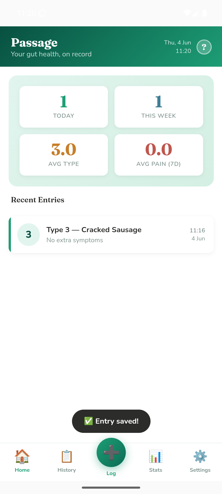
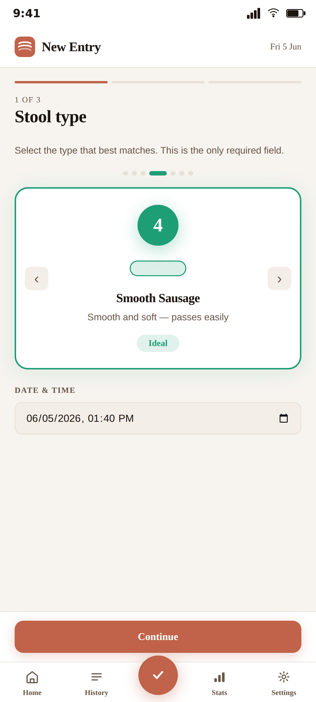
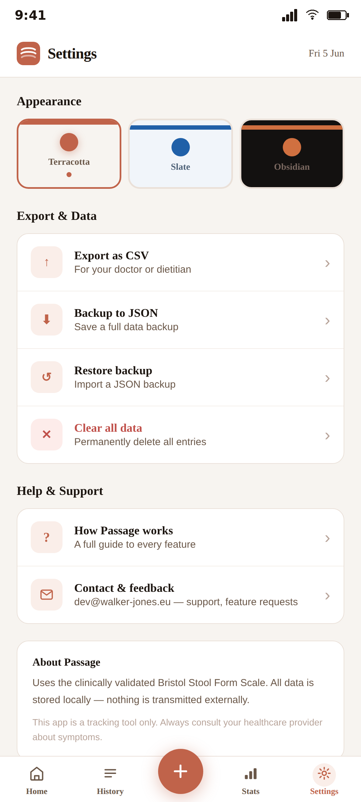
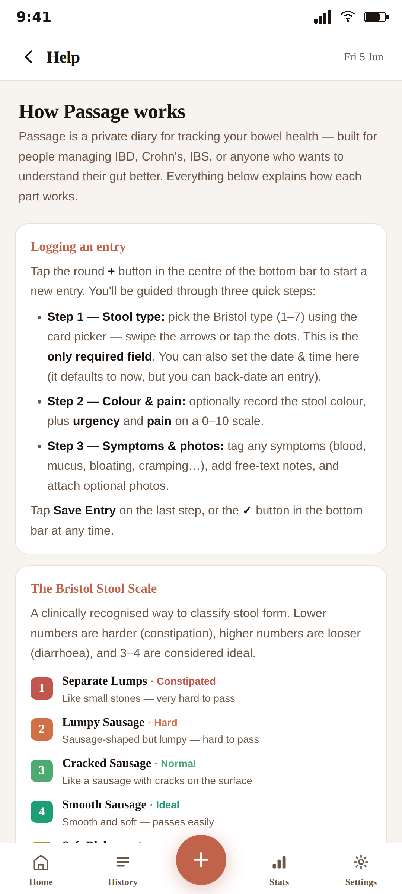

# Passage

**Your gut health, on record.**

Passage is a private bowel-health diary for people managing IBD, Crohn's, IBS, or anyone who
wants to understand their gut better. Log entries with the clinically recognised **Bristol Stool
Scale**, track symptoms, pain and urgency, and export a clear summary to share with your doctor.

It is deliberately calm and clinical — **no streaks, no badges, no gamification**. Just a quiet,
reliable record that makes your next appointment more productive.

<p align="center">
  
  
  
  
</p>

## Privacy first

All data is stored **only on your device** (IndexedDB). There are no accounts, no servers, no
analytics, no ads, and no tracking. Nothing is ever transmitted. CSV/JSON export is initiated by
you and shared via Android's standard share sheet to wherever you choose.

See [privacy-policy.html](privacy-policy.html).

## Features

- Bristol Stool Scale (Types 1–7) with clear descriptions
- Colour, urgency, pain, symptoms, notes and photos
- Monthly calendar and filterable history (by type, colour, symptom, pain) — edit or delete any entry
- Charts: daily frequency, type distribution, pain & urgency trends, time of day, symptom frequency
- CSV export for your healthcare team; full JSON backup & restore
- Three themes (including dark); works completely offline

## Tech

A single-file web app (vanilla HTML/CSS/JS) wrapped natively with
[Capacitor](https://capacitorjs.com/). Charts are hand-rolled inline SVG; the Space Grotesk and
DM Sans fonts are bundled locally for offline use. Storage is IndexedDB; file export/share uses
the Capacitor Filesystem + Share plugins.

```
www/                 the app (index.html + bundled vendor/ and fonts/)
assets/logo.png      icon source art (used to regenerate launcher icons)
android/             Capacitor Android project
store-assets/        Play Store icon, feature graphic, screenshots
capacitor.config.json
PUBLISH.md           Google Play publishing guide
privacy-policy.html
```

## Building from source

**Prerequisites:** Node.js 20+, Android Studio + SDK (Android 15 / API 35), JDK 17+ (Android
Studio's bundled JBR works).

```bash
npm install
npx cap sync android
```

Open `android/` in Android Studio and run, or from the command line:

```bash
cd android
./gradlew assembleDebug          # debug APK for testing
```

### Release builds (your own signing key)

Release signing material is **not** included in this repository. To build a signed release,
create your own keystore and an `android/app/keystore.properties` file:

```properties
storeFile=upload-keystore.jks
storePassword=YOUR_PASSWORD
keyAlias=upload
keyPassword=YOUR_PASSWORD
```

```bash
cd android
./gradlew assembleRelease        # signed APK (sideload)
./gradlew bundleRelease          # signed AAB (Play Store)
```

## Disclaimer

Passage is a personal symptom-tracking tool. It does not provide medical advice, diagnosis, or
treatment. Always consult a qualified healthcare professional about your symptoms.

---

© 2026 Walker-Jones · walker-jones.eu
